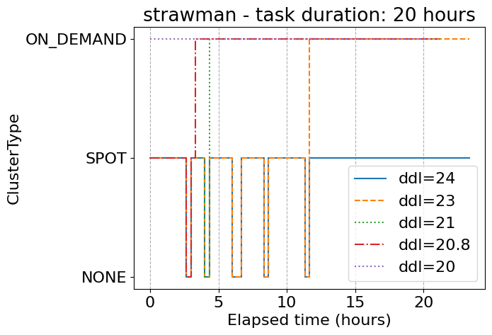
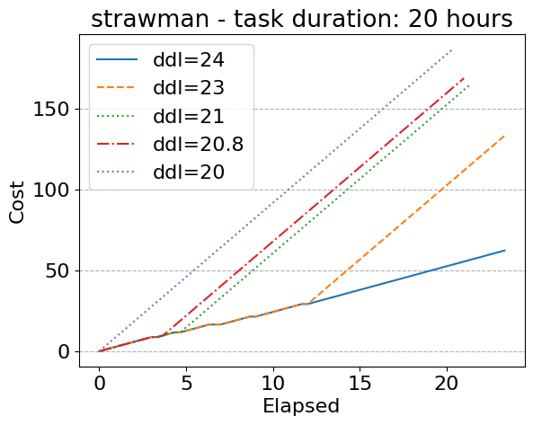
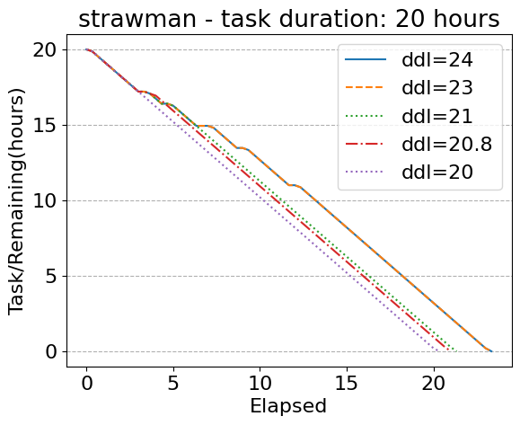

# SkyPilot Spot Strategy Simulator
Experiments for SkyPilot Spot Strategy

```
python ./main.py --env-config configs/env/trace/default.yaml \
    --strategy-config configs/strategy/strawman/default.yaml \
    --config configs/exp.yaml
```

## Spot / On-demand

### Strawman
Use spot until there is no enough time to finish the job before deadline. Switch to on-demand in that case.

#### Preliminary Figures



